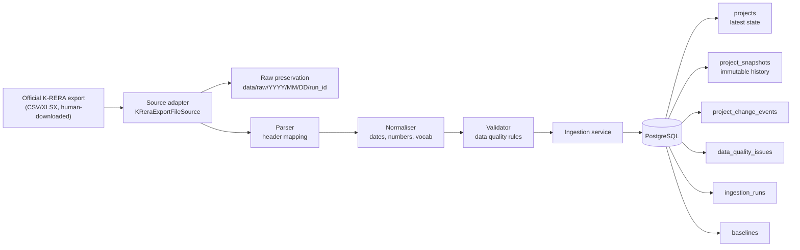
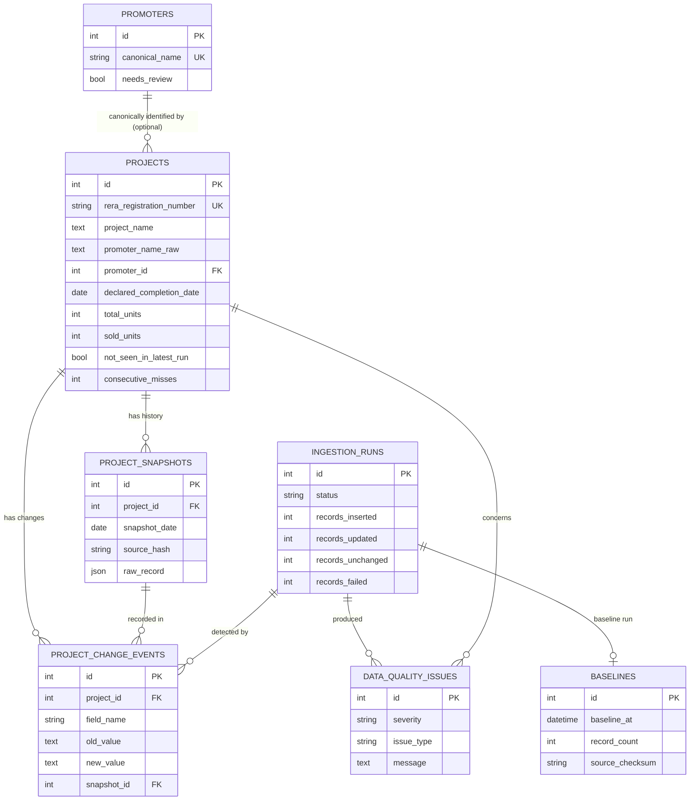

# Architecture

Phase 1 is a single Python application backed by PostgreSQL (SQLite is
supported for development/tests). No frontend, no public API, no orchestration
framework — deliberately simple, transparent, testable and maintainable.

## Pipeline

## Component responsibilities

| Module | Responsibility |
|--------|----------------|
| `rera.config` | Environment-driven settings (no hard-coded values) |
| `rera.logging_config` | Structured `key=value` logging |
| `rera.database.models` | SQLAlchemy 2.x ORM models |
| `rera.database.session` | Engine / session / `init_db` |
| `rera.sources.base` | `ReraSource` interface + provenance dataclasses |
| `rera.sources.krera` | Official-file adapter + polite HTTP inspect probe |
| `rera.ingestion.collector` | Fetch + raw artefact preservation |
| `rera.ingestion.parser` | Raw rows → `RawProjectRecord` (header mapping) |
| `rera.ingestion.normalizer` | Raw → `NormalizedProject` (raw retained) |
| `rera.ingestion.validator` | Non-fatal data quality findings |
| `rera.ingestion.snapshot` | Build immutable snapshots + source hash |
| `rera.ingestion.change_detector` | Field-level change events |
| `rera.services.ingestion_service` | Orchestration, idempotency, reporting |
| `rera.cli.main` | Command-line interface |

## Data model (ER)

## Key design decisions

1. **Separation of layers.** Source / parse / normalise / validate / persist are
   independent and unit-tested. The K-RERA site can change without touching the
   database layer.
2. **Raw before normalised.** Raw artefact preserved on disk and the full
   original row stored in `project_snapshots.raw_record`.
3. **Immutable history.** `project_snapshots` is append-only; previous snapshots
   are never modified.
4. **Hash-based change detection.** A deterministic SHA-256 of canonical source
   fields avoids unnecessary snapshots.
5. **Non-fatal validation.** Questionable records are stored *and* flagged;
   nothing is silently discarded.
6. **Fail safely.** If fetch/parse fails, the run is marked `FAILED` and no
   corrupted data is inserted.
7. **Promoter identity is reviewable.** No automatic merging on name similarity.
8. **Provider-agnostic storage.** Generic SQLAlchemy types -> PostgreSQL in
   production, SQLite for tests.

## Future compatibility

The schema already supports later phases without redesign: district analytics
(`district`), promoter analytics (`promoters`), project history
(`project_snapshots`), change timelines (`project_change_events`), regulatory
orders/complaints/quarterly progress/document metadata (new tables referencing
`projects`), alerts (queryable `not_seen_in_latest_run` / change events) and a
public API (read from existing tables).
